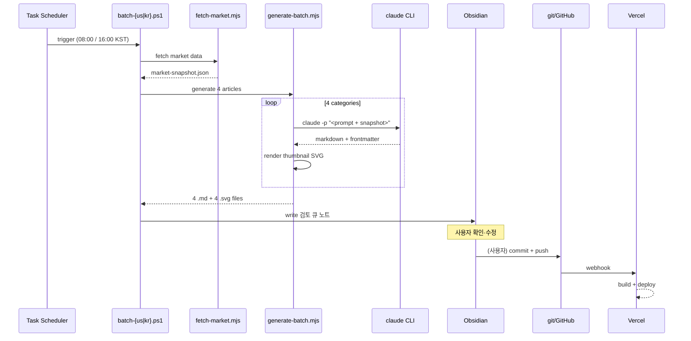

# Lincoln Brief 자동 발행 가이드

> [!abstract] 한 줄 요약
> **매일 KST 08:00 미국 4편, KST 16:00 한국 4편** — 카테고리당 한 편씩, 시장 데이터 fetch → Claude 초안 생성 → Obsidian에 검토 큐 → 사용자 승인 → git push → Vercel 자동 배포.

---

## 1. 발행 스케줄

| 시각 (KST) | 대상 | 트리거 시점의 시장 상태 | 데이터 가용성 |
|---|---|---|---|
| **08:00** | 미국 증시 | 전일 종가 마감 (NY 18:00 ET = KST 07:00 익일) | Yahoo Finance 종가 확정 |
| **16:00** | 한국 증시 | 당일 종가 마감 (KRX 15:30 KST) | KRX 일별 데이터 + DART 공시 마감 |

> [!note] 시간대 논리
> - 08:00 KST = NY 18:00 ET → 미국 마감 시세가 안정적으로 fetch 가능 (after-hours 1시간 반영)
> - 16:00 KST = KRX 마감 +30분 → 외국인 매매·기관 잠정치까지 반영된 KRX API 응답 안정

> [!tip] 주말·휴장일
> - 한국 주말 (토·일) → 양쪽 다 skip
> - 미국 휴장 (Memorial Day, July 4th 등) → 08:00 batch skip, 16:00 한국은 정상 진행
> - 한국 휴장 → 16:00 skip, 08:00 미국은 정상 진행
> - 휴장일 캘린더는 `yahoo-finance2` 의 `historical` 호출이 빈 응답 → 자동 감지 가능

---

## 2. 4 카테고리 (각 batch = 4편)

`src/consts.ts` 에 정의된 사이트 카테고리와 1:1 매핑.

### 2.1 `daily-brief` — 데일리 시황

> 그날 마감 핵심 요약. 지수·거래대금·수급·이슈 한 페이지.

- **슬러그 예**: `us-daily-brief-YYYYMMDD`, `kr-daily-brief-YYYYMMDD`
- **분량**: 5분 분량 (~1,200 단어), 표 2~3개
- **반드시 포함**: 지수 종가 표, 수급 (외국인/기관/개인), 환율·금리, 다음날 관전 포인트
- **5/18 한국 예시**: [[kr-daily-brief-20260518]] "공포의 다음 날 — 7,418, 박스의 첫 자리"

### 2.2 `stock-analysis` — 종목 분석

> 그날 핵심 종목 1개를 깊게. 펀더멘털 + 기술적.

- **슬러그 예**: `us-nvda-YYYYMMDD`, `kr-samsung-YYYYMMDD`
- **종목 선정 로직** (자동):
  1. 그날 거래대금 상위 5종목 중
  2. 변동률 |±2%| 이상 또는 시총 1위권 (AAPL/MSFT/NVDA, 삼성전자/SK하이닉스)
  3. 동일 종목 7일 이내 재발행 금지 (캐시 체크)
- **반드시 포함**: 일봉 차트 포인트, 밸류에이션, 주요 이벤트, 진입·이탈 시나리오

### 2.3 `market-forecast` — 시장 예측

> 거시·섹터 흐름 기반 단·중기 시나리오.

- **슬러그 예**: `us-spx-6000-YYYYMMDD`, `kr-kospi-box-YYYYMMDD`
- **선정 로직**: 지수가 심리적 레벨 (S&P 6000, KOSPI 7400 등) 근처일 때 우선
- **반드시 포함**: 베이스/베어/불 3 시나리오 + 각 확률 + 트리거 레벨

### 2.4 `economy-issue` — 경제 이슈

> 금리·환율·정책·글로벌 이벤트. 종목 너머의 거시 풍경.

- **슬러그 예**: `us-fed-cpi-YYYYMMDD`, `kr-krw-1500-YYYYMMDD`
- **선정 로직**: 그날 가장 시장을 움직인 매크로 이벤트 (FOMC, CPI, 금통위, 환율 레벨 돌파)
- **반드시 포함**: 이벤트 컨텍스트, 시장 반응, 향후 캘린더

---

## 3. 데이터 소스

| 카테고리 | 미국 | 한국 |
|---|---|---|
| 지수·종목 시세 | `yahoo-finance2` (^GSPC, ^IXIC, ^DJI, 개별 티커) | `yahoo-finance2` (^KS11, ^KQ11) + **korea-stock-mcp** (KRX) |
| 펀더멘털 | yahoo `quoteSummary` | **DART** (재무제표, 공시) via korea-stock-mcp |
| 환율 | DXY (^DXY) | USD/KRW (KRW=X) |
| 금리 | 10Y (^TNX), 2Y (^IRX) | KTB 10Y (Yahoo 부재 — BOK API 또는 수동) |
| 뉴스 컨텍스트 | (옵션) NewsAPI | (옵션) Naver Search MCP |

> [!warning] API 키 필요
> - **DART**: 무료, [opendart.fss.or.kr](https://opendart.fss.or.kr) 신청 → `DART_API_KEY`
> - **KRX**: 무료, [data.krx.co.kr](http://data.krx.co.kr) → `KRX_API_KEY`
> - 없으면 Yahoo 폴백으로 동작 (지수만, 종목 펀더멘털 빈약)

발급 절차: [`docs/API_KEYS.md`](file:///C:/claude/lincoln-brief/docs/API_KEYS.md)

---

## 4. 생성 아키텍처 — 3 옵션

### 옵션 A: Claude CLI 자식 프로세스 (추천) ⭐

```
Windows Task Scheduler
    ↓ cron (08:00 / 16:00 KST)
scripts/batch-us.ps1 / batch-kr.ps1
    ↓
1. node scripts/fetch-market.mjs --market=us|kr
    → src/data/market-snapshot.json 갱신
2. node scripts/generate-batch.mjs --market=us|kr
    → 카테고리별 4번 호출
    → claude -p "<prompt>" --output-format json
    → src/content/blog/{market}-{topic}-{date}.md 4개 생성
    → public/thumbnails/{slug}.svg 4개 생성
    → Obsidian에 '검토 큐' 노트 1개 생성 (4편 링크)
3. (사용자 검토 후 수동 또는 자동) git commit + push
    → Vercel 자동 빌드·배포
```

**장점**: Claude Code 구독 그대로 활용, API 비용 0, 토큰 한도 넉넉
**단점**: 로컬 PC가 켜져 있어야 함, Claude CLI 인증 만료 시 batch 실패
**비용**: 0원 (구독 내)

### 옵션 B: Claude API (GitHub Actions)

```
GitHub Actions cron (21:00 UTC = 08:00 KST 익일 / 07:00 UTC = 16:00 KST)
    ↓
ANTHROPIC_API_KEY 시크릿 + @anthropic-ai/sdk
    ↓
같은 흐름이지만 클라우드에서 실행
```

**장점**: 로컬 PC 무관, 신뢰도 ↑, 검토 큐도 GitHub Issue로
**단점**: 카테고리당 ~5K 입력 + 2K 출력 ≈ $0.07/편 → 일 8편 = $0.56/일 = $200/년
**비용**: 약 200,000원/년

### 옵션 C: Ollama 로컬 (qwen2.5:7b)

```
Windows Task Scheduler → Ollama API (이미 Jarvis에서 사용 중)
```

**장점**: 0원, 완전 로컬
**단점**: 시장 분석 글의 깊이·정확도 부족 (수치 hallucination 위험 ↑)
**비용**: 0원

> [!success] 추천: 옵션 A
> 이유:
> - 사용자가 이미 Claude Code 구독 보유
> - Jarvis 프로젝트에서 동일한 child_process 패턴 검증됨
> - 글의 질이 그대로 유지됨 (5/18 4편이 기준)
> - 로컬 PC 24/7 유지는 [[Jarvis]] 운영과도 정렬

---

## 5. 배치 시퀀스 (옵션 A 기준)



---

## 6. 초안 검토 워크플로

> [!important] 자동 발행하지 않음
> 5/18 작업처럼 **반드시 사람의 손이 닿은 후 publish**. AI 초안은 `draft: true` frontmatter 로 생성되어 빌드 시 제외됨.

### 사용자 작업 흐름

1. 배치 종료 알림 (Obsidian 노트 / Windows 토스트 / Discord 웹훅)
2. 옵시디언 검토 큐 노트 열기 — 4편 링크
3. 각 편을 열어 검토:
   - 수치 검증 (특히 fetch 데이터와 본문 일치 여부)
   - 통찰 단락 `[TODO: Lincoln 검토]` 마커 채우기 (또는 그대로 두면 다음 단계에서 LLM이 한 번 더)
   - `draft: true` 제거
4. 모두 OK → 터미널에서 `npm run publish:today` (스크립트가 git add/commit/push)
5. Vercel 빌드 완료 알림 (선택)

### 검토 큐 노트 구조

자동 생성되는 `검토 큐/{YYYY-MM-DD-US|KR}.md`:

```markdown
---
date: 2026-05-19
market: US
status: pending-review
---

# US 검토 큐 — 2026-05-19

- [ ] [[us-daily-brief-20260519]] — 데일리 시황
- [ ] [[us-nvda-20260519]] — 종목 분석
- [ ] [[us-spx-6000-20260519]] — 시장 예측
- [ ] [[us-fed-cpi-20260519]] — 경제 이슈

**fetch snapshot**: `market-snapshot-us-20260519.json`
**생성 모델**: claude-opus-4-7
**소요**: 3분 47초
```

---

## 7. 운영

### 수동 실행

```powershell
# 미국 batch 즉시 실행
.\scripts\batch-us.ps1

# 한국 batch 즉시 실행
.\scripts\batch-kr.ps1

# 특정 카테고리만 재생성
.\scripts\batch-us.ps1 -Category market-forecast
```

### 일시 중지 / 재개

```powershell
# Task Scheduler 비활성화
Disable-ScheduledTask -TaskName "LincolnBrief-US"
Disable-ScheduledTask -TaskName "LincolnBrief-KR"

# 재활성화
Enable-ScheduledTask -TaskName "LincolnBrief-US"
```

### 로그

- `logs/batch-{us|kr}-YYYYMMDD-HHMM.log` — fetch + 생성 로그
- 실패 시 Obsidian `검토 큐/_실패` 폴더에 에러 노트 자동 생성

### 트러블슈팅

| 증상 | 원인 | 해결 |
|---|---|---|
| Claude CLI 401 / 인증 만료 | 구독 토큰 만료 | `claude /login` 한 번 |
| Yahoo Finance 빈 응답 | 휴장일 | 자동 skip, 로그만 남김 |
| KRX 데이터 없음 | KRX_API_KEY 미설정 또는 한도 초과 | Yahoo 폴백으로 자동 전환 (지수만) |
| Vercel 빌드 실패 | mdx 파싱 오류 (특수문자) | 로컬 `npm run build` 로 사전 검증 후 push |
| 같은 종목 7일 연속 분석 | 캐시 누락 | `data/recent-stocks.json` 수동 reset |

---

## 8. 결정 필요 항목

> [!todo] 사용자 확인 필요 — 체크 후 구현 시작
> - [ ] **생성 아키텍처**: 옵션 A (Claude CLI 추천) / B (API) / C (Ollama)
> - [ ] **자동 발행 여부**: 검토 큐 거치기 (추천) / 완전 자동
> - [ ] **알림 방식**: Obsidian 노트만 / + Windows 토스트 / + Discord 웹훅
> - [ ] **휴장일 처리**: 자동 skip (추천) / 빈 placeholder 글 발행
> - [ ] **API 키 발급 여부**: DART/KRX 발급 (한국 분석 깊이 ↑) / Yahoo 폴백 유지
> - [ ] **종목 선정**: 자동 (거래대금+변동률) / 사용자가 매일 아침 지정

---

## 9. 다음 구현 단계

승인 후 작업 순서:

```dataview
TASK
WHERE !completed
```

- [ ] (1) `scripts/fetch-market.mjs` 를 `--market=us|kr` 플래그 받게 확장
- [ ] (2) 카테고리별 프롬프트 4개 작성 (`scripts/prompts/{category}.md`)
- [ ] (3) `scripts/generate-batch.mjs` 신규 작성 — Claude CLI 호출 + 4 .md 생성
- [ ] (4) Obsidian 검토 큐 노트 자동 생성 로직 추가
- [ ] (5) 썸네일 자동 생성 (기존 `generate-daily-brief.mjs` SVG 로직 재사용)
- [ ] (6) `batch-us.ps1` / `batch-kr.ps1` 래퍼 작성
- [ ] (7) Windows Task Scheduler 등록 (`schtasks /Create`)
- [ ] (8) 첫 실행 dry-run (실제 git push 없이) → 결과 검토
- [ ] (9) 실전 가동, 1주일 모니터링

---

## 10. 관련 문서

- 사이트 README: [`C:/claude/lincoln-brief/README.md`](file:///C:/claude/lincoln-brief/README.md)
- 글 스타일 가이드: [`C:/claude/lincoln-brief/STYLE.md`](file:///C:/claude/lincoln-brief/STYLE.md)
- 썸네일 시스템: [`C:/claude/lincoln-brief/docs/THUMBNAIL_GUIDE.md`](file:///C:/claude/lincoln-brief/docs/THUMBNAIL_GUIDE.md)
- API 키 발급: [`C:/claude/lincoln-brief/docs/API_KEYS.md`](file:///C:/claude/lincoln-brief/docs/API_KEYS.md)
- 운영 사이트: https://lincoln-brief.vercel.app
- GitHub: https://github.com/LingCun/lincoln-brief
- 참고 톤·포맷 기준: https://blog.naver.com/press02

---

> [!info] 이 문서 위치
> `Obsidian Vault/Lincoln Brief/자동화 가이드.md`
> 결정사항 확정되면 이 문서 상단 `status: draft` → `status: approved` 로 바꾸고 알려주세요. 그때부터 위 9번 체크리스트 순차 진행.
