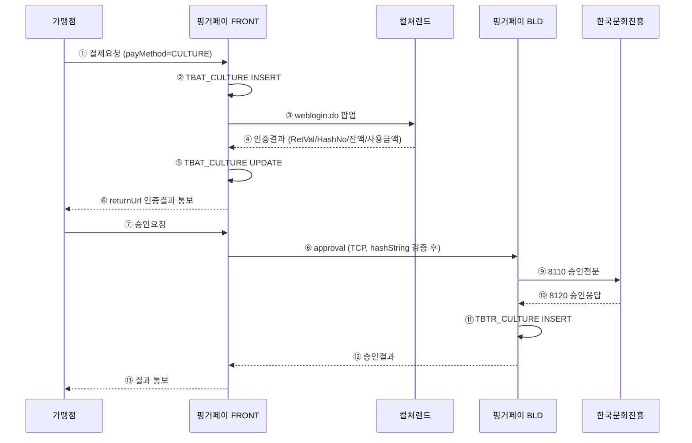

# 컬처캐쉬(CULTURE) 결제 연동 — 분석 · 설계

> Jira 분석/설계 섹션 등록용 문서. 코드 레벨 디테일은 별도 산출물에 위임하고, 본 문서는 **요건 · 범위 · 흐름 · 일정 · 테스트** 에 집중한다.

---

## 1. 개요

### 1.1 목적

핑거페이 결제 플랫폼에 **컬처캐쉬(한국문화진흥, ID/PW 방식)** 를 신규 결제수단으로 추가한다.
컬쳐랜드 로그인 팝업을 통한 사용자 인증 → 핑거페이 BLD ↔ 한국문화진흥 승인전문(8110/8120) 처리 → 가맹점 결과 통보 까지의 전 구간을 본 프로젝트 범위로 한다.

### 1.2 범위

| 구분 | 내용 |
|---|---|
| **대상 시스템** | 핑거페이 FRONT, BLD(v3), DB |
| **결제 종류** | 일반결제(승인) · 전체취소 · 망상취소 |
| **부분취소** | **미지원** (기획 확정) |
| **인증 방식** | 컬쳐랜드 ID/PW (weblogin.do / mobilelogin.do 팝업) |
| **연동 외부** | 컬쳐랜드(인증) · 한국문화진흥(승인/취소 전문) |
| **개발 전략** | Mock 우선 (가맹점 MemberCode 수령 전까지 stub 모드로 뒷단 우선 개발) |

### 1.3 비범위(Out of Scope)

- 부분취소 / 분할승인
- 컬쳐랜드 회원 가입·정보조회 등 인증 외 부가 API
- 가맹점용 별도 백오피스 UI

---

## 2. 영향도 분석

### 2.1 시스템 영향

| 시스템 | 영향 | 비고 |
|---|---|---|
| FRONT (핑거페이) | 컨트롤러 1종 신설, 결제수단 서비스 1종 보강, 매퍼 1종 신설 | 가맹점 진입 → 인증 콜백 처리 |
| BLD (v3) | **신규 JVM 인스턴스 추가 (포트 20501)**, 처리빈 2종(승인/취소) 신설, 매퍼 1종 신설 | pmCd별 별도 JVM 아키텍처 |
| DB | 신규 테이블 3종, 공통 코드/가맹점 등록 7행 | 운영 DBA 사전 검토 완료 |
| 운영 인프라 | 신규 포트(20501) 방화벽 개방, BLD 인스턴스 기동 스크립트 추가 | 운영 이관 시 별도 작업 |

### 2.2 신규 코드값

| 항목 | 값 | 의미 |
|---|---|---|
| PM_CD | `32` (값 `CULTURE`) | 결제수단 코드 |
| SPM_CD | `07` (값 `CULTURE`) | 결제수단 세부코드 |
| PTN_CD | `CULT` (4자 제한) | 파트너 코드 |
| 테스트 MID | `100000098m` | |
| MOCK MemberCode | `MOCKCULTURE1` (12자) | 실 가맹점코드 수령 후 교체 |
| BLD 포트 | `20501` | 컬처캐쉬 전용 JVM |

---

## 3. 데이터 설계

### 3.1 신규 테이블 3종

| 테이블 | 위치 | 용도 |
|---|---|---|
| `TBAT_CULTURE` | FRONT | 컬쳐랜드 로그인 인증 결과(호출 파라미터 + 콜백 응답) 저장 |
| `TBTR_CULTURE` | BLD | 컬처캐쉬 거래 원장 (8110 송신 / 8120 응답 매핑) |
| `TBUS_CULTURE` | BLD | 컬처캐쉬 실패 원장 (8120/8220/8720 실패 응답 저장) |

### 3.2 공통 코드/가맹점 등록 (7행)

- `TBAD_CODE` — PM_CD `32`, SPM_CD `07`, 결과코드 5종(`0000`/`F201`/`F901`/`3081`/`F999`)
- `TBSI_PTN_CPID` — `(CULT, MOCKCULTURE1)` 파트너 마스터
- `TBSI_MBS_PTN_LNK` — 가맹점-파트너 매핑
- `TBSI_MBS_SVC` — 가맹점 서비스 사용 플래그

> 적용 SQL: `2026-05-19_컬처캐쉬_DB셋업_v03.sql` (TEARDOWN + CREATE, idempotent).

---

## 4. 처리 흐름

### 4.1 정상 결제 흐름 (LIVE 목표)

### 4.2 취소 흐름

- **전체취소**: 가맹점 취소요청 → FRONT → BLD → 8210 송신 → 8220 응답 → `TBTR_CULTURE` UPDATE / 실패 시 `TBUS_CULTURE` INSERT.
- **망상취소(자동)**: 승인 응답 timeout 시 BLD 가 8710 자동 송신 → `TBCC_REVOKE_HIST.NET_CAN_FLG=1`.

### 4.3 현행 MOCK 흐름 (가맹점코드 수령 전 임시)

- 컬쳐랜드 팝업 단계 건너뛰기 → 콜백 컨트롤러가 **항상 성공(RetVal=0000) 응답 합성**.
- BLD 측 8110/8210 송신 없이 **Mock 8120/8220 응답 합성**.
- 가맹점·기획 검토 시 동작 흐름과 화면 전이를 확인하기 위한 임시 모드. **실연동 전 자동으로 LIVE 분기로 전환**된다.

---

## 5. 인증 · 보안 설계

본 결제수단은 인증 짝이 다른 **두 종류의 해시가 동시에 존재**한다. 한쪽으로 통합 불가하며 양쪽 모두 운영해야 한다.

| 항목 | 핑거페이 hashString | 컬쳐랜드 LoginHashCode |
|---|---|---|
| 인증 방향 | 가맹점 ↔ 핑거페이 | 가맹점 ↔ 컬쳐랜드 |
| 알고리즘 | SHA-256 | MD5 |
| 비밀키 | 가맹점 키(MKEY) | 없음 (평문 조합) |
| 검증 시점 | `/payment/v1/approval` 진입 시 | 컬쳐랜드 팝업 호출 시 |
| 검증 위치 | 핑거페이 FRONT | 컬쳐랜드 서버 |
| 만료 정책 | (해당없음, 1회용) | HashNo 10분 만료(예정) |

추가 보안 항목 (현재 미구현, 후속 과제):
- NONCE 위조방지 (콜백 재공격 차단)
- HashNo timeout 강제 검증

---

## 6. 변경 산출물 요약

> 파일 단위 절대경로는 별도 *변경파일 목록* 문서(Step 01~06) 참조. 본 표는 모듈 단위 요약.

### 6.1 FRONT

| 구분 | 모듈 | 비고 |
|---|---|---|
| 신규 | 컬처캐쉬 매퍼 (인터페이스 + XML) | TBAT_CULTURE CRUD |
| 신규 | 컬쳐랜드 콜백 컨트롤러 (`/cultureReturn.do`) | 인증 결과 수신 |
| 신규 | 결과/주문/취소 샘플 화면 3종 | 테스트·시연용 |
| 수정 | 결제수단 공통 상수/서비스/유틸 | PM_CD=32, SPM_CD=07 통합 |
| 수정 | 검증 AOP(spmCd 자동매핑) | CULTURE 보정 로직 추가 |
| 수정 | 환경 설정 JSON 3종(`info-{local,dev,prod}.json`) | BLD 라우팅 정보 |

### 6.2 BLD

| 구분 | 모듈 | 비고 |
|---|---|---|
| 신규 | 컬처캐쉬 처리빈(승인/취소) 2종 | Mock 모드 포함 |
| 신규 | 컬처캐쉬 매퍼 (인터페이스 + XML) | TBTR_CULTURE / TBUS_CULTURE |
| 신규 | 컬처캐쉬 공통 헬퍼/상수 | |
| 수정 | mybatis 설정 / 결제수단 설정 JSON 3종(`payinfo-{local,dev,prod}.json`) | bldId=CULTURE, bldPort=20501 |
| 예정 | 공통 매퍼 saveMstr PM_CD=32 분기 | Step 07 |

### 6.3 DB

- 신규 테이블 3종 DDL · 공통 코드/가맹점 등록 7행. (적용 SQL = v03)

---

## 7. 일정 및 인력

### 7.1 마스터 일정 (8주 / 2개월)

| 단계 | 기간 | 산출물 |
|---|---|---|
| 요구사항 확정 · DDL 검토 | 2주 (0.5개월) | 분석 보고서, DDL 초안 |
| FRONT · BLD 개발 / DB 적용 | 4주 (1.0개월) | 코드, 매퍼, 환경설정, 테스트 가맹점 |
| 통합 테스트 (QA) | 2주 (0.5개월) | 시나리오 T1~T9 결과 |
| **합계** | **8주** | |

> ⚠ **리스크**: 한국문화진흥 측 가맹점 계약 완료 → MemberCode 발급 후 실연동 가능. 계약 일정에 따라 Phase 3 추가 지연 가능.

### 7.2 인력 산정 (1인 기준, 26.5 MD)

| 항목 | MD | 비고 |
|---|---|---|
| 분석/설계 | 4.0 | 분석보고서 + DDL + 가이드 |
| FRONT 개발 | 6.0 | 컨트롤러/서비스/매퍼/뷰 |
| BLD 개발 | 7.0 | 처리빈/매퍼/JVM 인스턴스 |
| DB 적용/검증 | 1.0 | DDL + 데이터 셋업 |
| 단위 테스트 | 2.0 | FRONT/BLD JUnit |
| 통합 테스트 | 2.5 | 시나리오 T1~T9 |
| 가맹점 가이드 보강 | 1.5 | 인증결제 가이드 기준 작성 |
| 운영 배포 / 모니터링 | 2.5 | 방화벽, JVM 기동, 로그 점검 |

---

## 8. 진행 현황 (Phase)

| Phase | 단계 | 상태 | 비고 |
|---|---|---|---|
| Phase 1 | DB 적용 (v03) | ✅ 완료 (2026-05-19) | 3종 테이블 + 코드/가맹점 등록 |
| Phase 2 | FRONT 소스 (Step 02~04) | ✅ 완료 | 상수/서비스/매퍼/컨트롤러/뷰 |
| Phase 2 | BLD 소스 (Step 05~06) | ✅ 완료 | 매퍼 + 처리빈 4종(Mock) |
| Phase 2 | BLD JVM 기동 / E2E 검증 | ⏳ 진행 | -Dbld.id=CULTURE 옵션, 포트 20501 LISTEN |
| Phase 2 | 공통 매퍼 saveMstr PM_CD=32 분기 (Step 07) | ⏳ 예정 | E2E 검증 후 |
| Phase 3 | 실연동 (가맹점코드 수령 후) | ⏳ 대기 | PTN_CPID UPDATE + Mock 분기 제거 + 통합테스트 |

---

## 9. 위험 및 제약

| ID | 위험/제약 | 영향 | 대응 |
|---|---|---|---|
| R1 | 한국문화진흥 가맹점 계약 지연 | Phase 3 진입 지연 | Mock 모드로 뒷단 우선 개발 (현재 적용 중) |
| R2 | BLD JVM 인스턴스 추가에 따른 운영 부담 | 인프라 변경 필요 | 운영팀 사전 공유, 기존 결제수단 패턴(VACNT/CRCT) 차용 |
| R3 | HashNo 만료 / NONCE 위조 방지 미구현 | 보안 취약 | 후속 과제로 분리, Phase 3 직전 보강 |
| R4 | 부분취소 미지원 정책의 가맹점 측 혼선 | 운영 문의 발생 | 가맹점 가이드에 명시, 거절 응답 코드 정의(`F211`/`2028`) |
| R5 | TID 생성 타이밍으로 인한 콜백 INSERT 우회 | 데이터 정합성 | UPSERT 패턴으로 우회 적용, 근본 해결은 후속 과제 |

---

## 10. 테스트 범위

### 10.1 통합 테스트 시나리오 (T1~T9)

| # | 시나리오 | 기대 결과 |
|---|---|---|
| **T1** | 정상 결제 (일반쇼핑) | `TBTR_MSTR.RSLT_CD=0000`, `TBTR_CULTURE` INSERT, 가맹점 결과 통보 |
| **T2** | 정상 결제 (도서공연, BuyBook=Y) | T1 + `TBTR_NTS_CRCT_REQ` INSERT |
| **T3** | 사용자 인증 취소 (컬쳐랜드 팝업 종료) | `TBAT_CULTURE.AUTH_RSLT_CD=9999`, 가맹점 `resultCd=9999` |
| **T4** | HashNo 만료 후 승인 시도 | `F407`/`F408` 거절 |
| **T5** | 컬쳐랜드 잔액 부족 응답 | `TBUS_CULTURE` INSERT (`CULTURE_RSLT_CD`=잔액부족코드) |
| **T6** | 전체취소 정상 | `TBTR_MSTR.TRX_ST_CD=2`, `TBCC_REVOKE_HIST` INSERT |
| **T7** | 부분취소 요청 거절 (`partCanFlg=1`) | `F211` / `2028` 응답, 컬쳐랜드 송신 없음 |
| **T8** | 망상취소 (8710) | `TBCC_REVOKE_HIST.NET_CAN_FLG=1` |
| **T9** | 컬쳐랜드 socket timeout | 망취소 자동 전송 + 가맹점 통보 |

### 10.2 테스트 환경

| 항목 | 값 |
|---|---|
| 테스트 MID | `100000098m` |
| 테스트 MemberCode | `MOCKCULTURE1` (Mock) / 실 코드(Phase 3) |
| BLD 포트 | `20501` (`-Dbld.id=CULTURE` JVM 옵션) |
| 사전 DB 등록 | 7행 (`TBAD_CODE`/`TBSI_PTN_CPID`/`TBSI_MBS_PTN_LNK`/`TBSI_MBS_SVC`) |
| 검증 쿼리 | 분석보고서 §9.6 참고 |

### 10.3 단위 테스트

- FRONT: 콜백 컨트롤러 입력 검증, 매퍼 4개 메서드, 검증 AOP
- BLD: 처리빈 2종(Mock/Real 분기), 매퍼 6개 메서드, 결과코드 매핑

---

## 11. 알려진 한계 / 후속 과제

1. **콜백 항상 성공 합성(STEP1 임시)** — 컬쳐랜드 실연동 시점에 form param 기반 정상 분기로 전환.
2. **TID 생성 타이밍** — 콜백 UPSERT 우회 중. 근본 해결(TID 선생성)은 Phase 3 직전 일정 검토.
3. **가맹점 returnUrl auto-POST 미구현** — Phase 3 진입 전 보강.
4. **HashNo timeout 검증** — 정책 확정 후 추가.
5. **NONCE 위조 방지(CSRF/replay)** — 보안 리뷰 시점에 보강.

---

## 12. 참고 산출물

| 문서 | 절대경로 | 비고 |
|---|---|---|
| **본 문서(분석/설계)** | `C:\claude\vault\업무\컬처캐쉬\2026-05-22_컬처캐쉬_지라_분석설계.md` | Jira 등록용 |
| 현행 상태 스냅샷 | `C:\claude\vault\업무\컬처캐쉬\_LATEST.md` | 코드/DB 실제 적용본 |
| 분석 보고서 v01.0 | `C:\claude\vault\업무\컬처캐쉬\2026-05-18_컬처캐쉬_연동_분석보고서_v01.0.md` | 전체 명세 (테이블 매핑·테스트환경·T1~T9 상세) |
| 가맹점 연동 가이드 v01.0 | `C:\claude\vault\업무\컬처캐쉬\2026-05-18_핑거페이_가맹점연동가이드_컬처캐쉬_v01.0.docx` | 가맹점 배포본 |
| DB 셋업 SQL v03 | `C:\claude\vault\업무\컬처캐쉬\2026-05-19_컬처캐쉬_DB셋업_v03.sql` | 활성 SQL |
| 변경파일 목록 (FRONT Step 01~04 / BLD Step 05~06) | `C:\claude\vault\업무\컬처캐쉬\2026-05-{18,19}_컬처캐쉬_{FRONT,BLD}변경파일목록_step0X.md` | 파일 단위 절대경로 |

---

*문서 작성: 2026-05-22. 변경 시 본 문서의 해당 섹션을 덮어쓰기.*
