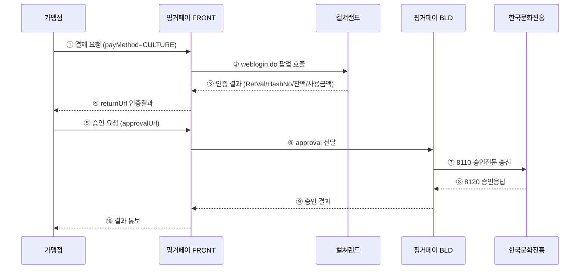

# 컬처캐쉬 (CULTURE) 결제수단 추가

> 핑거페이에 컬처캐쉬(한국문화진흥 컬쳐랜드, ID/PW 방식) 결제수단을 신규 추가하는 프로젝트.

## 프로젝트 메타

| 항목 | 값 |
|---|---|
| 대상 시스템 | 핑거페이 FRONT, BLD-v3 |
| 신규 PM_CD | `32` (코드 레벨 `PM_CD_32_CULTURE`, 값 `"CULTURE"`) |
| 신규 SPM_CD | `07` (코드 레벨 `SPM_CD_07_CULTURE`/`SPM_CD_CULT_07`, 값 `"CULTURE"`) |
| 신규 PTN_CD | `"CULT"` (FRONT 로컬 `PTN_CD_CULT`, 값/상수명 모두 CULT — DB PTN_CD 컬럼 4자 제한) |
| 명명 규약 | **코드/DB 전 레이어 `CULTURE` 통일** (2026-05-19 2차 정정) → [[2026-05-19_컬처캐쉬_네이밍규약_정정]] |
| 신규 테이블 | `TBAT_CULTURE` (FRONT), `TBTR_CULTURE` / `TBUS_CULTURE` (BLD) |
| 테스트 MID | `100000098m` |
| 테스트 MemberCode | **`MOCKCULTURE1`** (12자, MOCK, 컬쳐랜드 가맹점코드 수령 후 UPDATE) |
| DB 방언 | MariaDB / MySQL |
| 취소 정책 | **전체취소 + 망상취소만** (부분취소 미지원) |
| 개발 예상 | 약 **2개월** (1인 단독 기준, 26.5 MD) |
| 진행 모드 | **Mock 우선** — 컬쳐랜드 가맹점코드 수령 전까지 stub 모드로 뒷단 프로세스 우선 개발 |

## 산출물

| 파일 | 설명 | 상태 |
|---|---|---|
| **[[_LATEST\|★ 현행상태 (최종 적용본)]]** | **현재 시점에 실제 적용된 코드/DB/명명 상태만 기록. 변경 발생 시 덮어쓰기** | **active (단일 진실 공급원)** |
| [[2026-05-22_컬처캐쉬_지라_분석설계\|★ Jira 분석/설계 등록용 문서 (풀버전)]] | 총괄/기획/테스터 대상 분석·설계 정리본 12개 섹션 | **active (2026-05-22 신규)** |
| [[2026-05-22_컬처캐쉬_지라_분석설계_축약본\|★ Jira 분석/설계 축약본 (FP-411 페이스트용)]] | 풀버전 축약. Mermaid → 텍스트 흐름, 표 압축 | **active (2026-05-22 신규)** |
| [[2026-05-18_컬처캐쉬_연동_분석보고서_v01.0\|분석 보고서 (.md)]] | CULTURE 테이블 명세, 컬쳐랜드 ↔ 핑거페이 매핑, 공수 산정, 테스트 환경 구성 | active (2026-05-19 DB명 정정 반영) |
| [[2026-05-18_컬처캐쉬_FRONT변경파일목록_step01\|FRONT 변경파일 목록 — Step 01]] | sample.html + orderSampleCulture.html + cancelSampleCulture.html | done |
| [[2026-05-19_컬처캐쉬_FRONT변경파일목록_step02\|FRONT 변경파일 목록 — Step 02]] | Constants.java + CultureCashService.doStart() spmCd 교체 | done |
| [[2026-05-19_컬처캐쉬_FRONT변경파일목록_step03\|FRONT 변경파일 목록 — Step 03]] | CultureMapper.java + CultureMapper.xml 신설 (TBAT_CULTURE) | done |
| [[2026-05-19_컬처캐쉬_FRONT변경파일목록_step04\|FRONT 변경파일 목록 — Step 04]] | CultureReturnController + cultureReturn.html + CultureCashService INSERT/returnUrl 변경 | done |
| [[2026-05-19_컬처캐쉬_BLD변경파일목록_step05\|BLD 변경파일 목록 — Step 05]] | CultureMapper.java + culture.xml + mybatis-config 등록 (TBTR_CULTURE/TBUS_CULTURE) | done |
| [[2026-05-19_컬처캐쉬_BLD변경파일목록_step06\|BLD 변경파일 목록 — Step 06]] | CultureConstants + CommonCultureMethod + PayCultureBean + CancelCultureBean (Mock 모드) | done |
| [[2026-05-26_컬처캐쉬_FRONT변경파일목록_tid보강\|FRONT TID 보강 — 2026-05-26]] | MerchantMapper.updateTransRequestTidForCulture 신설 + CultureReturnController 콜백 UPDATE + CultureCashService.doMakeBldSendApprovalData 오버라이드 (방어 다층) | done |
| [[2026-05-19_컬처캐쉬_네이밍규약_정정\|네이밍 규약 정정 (CULTURELAND/CURT → CULTURE)]] | 사용자 수동 일괄 변경. front 1차(코드) + 2차(DB) 모두 적용 | **active (반드시 참고)** |
| [가맹점용 연동 가이드 (.docx)](2026-05-18_핑거페이_가맹점연동가이드_컬처캐쉬_v01.0.docx) | 가맹점이 컬처캐쉬 연동 시 참고 | active |
| **[★ DB셋업 SQL v03 (.sql)](2026-05-19_컬처캐쉬_DB셋업_v03.sql)** | **실제 적용용** (CULTURE 3종 DDL, PTN_CD='CULT' (4자), PTN_CPID='MOCKCULTURE1'). §① TEARDOWN (CURT+CULTURE 양쪽 DROP/DELETE) → §②~④ 신규 CREATE/INSERT. **idempotent** — 기존 환경 상태와 무관하게 재실행 가능 | **active** |
| [DB셋업 SQL v02 (.sql)](2026-05-18_컬처캐쉬_DB셋업_v02.sql) | (참고) 원본 CURT 명명. v03 으로 대체됨 | superseded |
| [DB셋업 SQL v01 (.sql)](2026-05-18_컬처캐쉬_테스트환경_setup.sql) | (참고) Oracle 방언, demotest0m. v02 으로 대체됨 | superseded |

> 💡 **링크가 안 열리면**: Obsidian 설정 → Files & Links → **"Detect all file extensions"** ON 으로 켜시면 .sql / .docx 도 vault 내부에서 미리보기/네비 가능. (기본 OFF 라 .md 외 파일은 OS 기본 앱으로 열림)

## 처리 흐름 (요약)

## 일정 (마스터 보고 기준)

| 단계 | 기간 |
|---|---|
| 요구사항 확정 / DDL 검토 | 0.5개월 (2주) |
| FRONT·BLD 개발 / DB 적용 | 1.0개월 (4주) |
| 통합 테스트 (QA) | 0.5개월 (2주) |
| **합계** | **2.0개월 (8주)** |

> ⚠ **리스크**: 컬처캐쉬(한국문화진흥) 측 계약 완료 → 가맹점 키(MemberCode) 발급 후 실연동 테스트 가능. 계약 일정에 따라 추가 지연 가능성.

## 외부 참고 자료 (원본 위치)

- `C:\Users\finger\Downloads\01. 작업\07. 컬처캐시 연동\` (작업 원본 폴더)
- `핑거페이_가맹점연동가이드_인증결제_v0.9.4.docx` (기존 카드 인증결제 가이드, 본 가이드의 기준)
- `FW_ Fwd_ 컬쳐캐시 연동 가이드/컬쳐캐쉬연동 전문 (IDPW 방식)/IDPW방식_결제전문.doc`
- `웹_컬쳐랜드로그인전문.docx`, `모바일웹_컬쳐랜드로그인전문.docx`

## 코드베이스 참조 (작업 원본 기준)

- `front/src/main/java/solpay/wiezon/com/payMethod/service/CultureCashService.java` — Phase 2 Step 04 까지 적용
- `front/src/main/java/solpay/wiezon/com/common/inf/Constants.java` — `PM_CD_32_CULTURE`, `SPM_CD_07_CULTURE`, `SPM_CD_CULT_07` 적재 완료
- `front/src/main/java/solpay/wiezon/com/controller/CultureReturnController.java` — 콜백 컨트롤러 (Step 04 신설)
- `front/src/main/java/solpay/wiezon/com/mapper/CultureMapper.java` + `resources/mapper/CultureMapper.xml` — TBAT_CULTURE 매퍼 (Step 03 신설, 2026-05-19 CURT→CULTURE 정정)
- `front/src/main/resources/templates/culture/common.html` — 컬쳐랜드 로그인 팝업 view (Step 01 완료)
- `front/src/main/resources/templates/culture/cultureReturn.html` — 콜백 결과 페이지 (Step 04 신설)
- `front/src/main/resources/templates/sample/orderSampleCulture.html` / `cancelSampleCulture.html` — 테스트 페이지 (Step 01 신설 → 2026-05-19 네이밍 정정 시 rename)
- `bld-v3/src/main/resources/mapper/card.xml` — 신규 `culture.xml` 작성 시 참조 패턴

## 다음 액션

### Phase 1 — 데이터/스키마 적재 ✅ 완료 (2026-05-19)

- [x] [[2026-05-18_컬처캐쉬_DB셋업_v02]] 개발 DB 적용 (DDL 3종 + 공통코드 + 가맹점 등록)
- [x] §④ 검증 쿼리 3개 실행 → 등록 확인
- [x] DBA 협업 — DDL 자릿수/제약/인덱스 리뷰 후 정정 (필요 시)

### Phase 2 — 소스 수정 (지금 진행)

- [x] FRONT `Constants.java` 에 `SPM_CD_07_CULTURE = "07"` 상수 추가 ✅ 2026-05-19 *(원래 `SPM_CD_07_CURT` 였으나 네이밍 정정 적용)*
- [x] FRONT `CultureCashService.doStart()` `SPM_CD_01_AUTH` → `SPM_CD_07_CULTURE` 교체 ✅ 2026-05-19
- [x] FRONT `CultureMapper.xml` 신설 (TBAT_CULTURE INSERT/UPDATE/SELECT) ✅ 2026-05-19
- [x] FRONT 콜백 컨트롤러 (`/cultureReturn.do`) — **Mock 분기 포함** (MemberCode='MOCKCULTURE1' 시 stub 응답) ✅ 2026-05-19
- [ ] **DB v03 적용** ([[2026-05-19_컬처캐쉬_DB셋업_v03]]) — §① TEARDOWN (구 CURT/CULTURE 객체 일괄 DROP+DELETE) → §②~④ 신규 CREATE/INSERT
- [x] BLD `culture.xml` 신설 (TBTR_CULTURE/TBUS_CULTURE INSERT/UPDATE) ✅ 2026-05-19 — [[2026-05-19_컬처캐쉬_BLD변경파일목록_step05]]
- [x] BLD `CultureCashService` — **Mock 모드** : 8110/8210/8710 송신 대신 가짜 성공 응답 반환 (PayCultureBean + CancelCultureBean) ✅ 2026-05-19 — [[2026-05-19_컬처캐쉬_BLD변경파일목록_step06]]
- [ ] BLD `common.xml` saveMstr 등에 PM_CD=32 분기 추가

### Phase 3 — 실연동 (가맹점코드 수령 후)

- [ ] `UPDATE TBSI_PTN_CPID/MBS_PTN_LNK SET PTN_CPID='<실제코드>'`
- [ ] Mock 분기 코드 제거 또는 환경변수로 toggle
- [ ] 통합 테스트 시나리오 T1~T9 실행
- [ ] 운영 배포

## 변경 이력

| 일자 | 버전 | 내용 |
|---|---|---|
| 2026-05-18 | v01.0 | 최초 분석 보고서 / 가이드 / SQL setup 작성. SPM_CD 07(CURT) 신규 정의. 부분취소 미지원 반영. |
| 2026-05-18 | v02 (SQL) | DB 셋업 SQL 재작성 — MariaDB 방언, MID `100000098m`, MOCK MemberCode `MOCKCURT0001`, CURT 3종 DDL 포함. Mock 우선 전략 채택 (가맹점코드 수령 대기). |
| 2026-05-19 | — | **Phase 1 완료** — 개발 DB에 DDL 3종 + 공통코드 + 가맹점 등록 적용 / 검증쿼리 확인 / DBA 리뷰 완료. Phase 2 (소스 수정) 진입. |
| 2026-05-19 | — | **Step 02 완료** — FRONT `Constants.java` 에 `SPM_CD_07_CURT="07"` / `SPM_CD_CURT_07="CURT"` 추가, `CultureCashService.doStart()` 의 spmCd 2개소를 `SPM_CD_01_AUTH` → `SPM_CD_07_CURT` 로 교체. |
| 2026-05-19 | — | **Step 03 완료** — FRONT `CurtMapper.java` (interface) + `CurtMapper.xml` (mybatis) 신설. TBAT_CURT 4개 쿼리: insertTbatCurt / updateTbatCurt / checkTbatCurt / selectTbatCurt. AuthMapper 패턴 그대로 차용. |
| 2026-05-19 | — | **Step 04 완료** — FRONT 콜백 컨트롤러 `/cultureReturn.do` 신설 (CultureReturnController). MOCK 분기(MBR_CD=MOCKCURT0001 → 고정 stub 응답: RetVal=0000/HashNo=NONCE기반/MCASH_AMT=1,000,000/USE_AMT=REQ_AMT). CultureCashService.doStart() 에 TBAT_CURT INSERT 추가, returnUrl 을 `/cultureReturnSample.do` → `/cultureReturn.do?nonce={NONCE}` 로 변경 (NONCE 식별용 쿼리스트링). 결과 페이지 `templates/culture/cultureReturn.html` 신설. |
| 2026-05-19 | — | **네이밍 규약 1차 정정** (사용자 직접 수동) — front 코드 레이어만. `CULTURELAND` / `CULTUREGIFT` / `CURT` → `CULTURE` 통일. 영향 파일 10건. 상세: [[2026-05-19_컬처캐쉬_네이밍규약_정정]]. |
| 2026-05-19 | v03 (SQL) | **네이밍 규약 2차 정정** (DB 포함 일괄) — DB 테이블/컬럼/PK/인덱스/MemberCode 까지 `CULTURE` 로 통일. 테이블 `TBAT_CURT`/`TBTR_CURT`/`TBUS_CURT` → `TBAT_CULTURE`/`TBTR_CULTURE`/`TBUS_CULTURE`, 컬럼 `CURT_USER_ID/CURT_CUST_ID/CURT_RSLT_CD/CURT_RSLT_MSG` → `CULTURE_*`, PTN_CPID `'MOCKCURT0001'` → `'MOCKCULTURE1'` (12자). FRONT 매퍼 `CurtMapper.java`/`.xml` → `CultureMapper.java`/`.xml` 리네임 + 메서드명 (insertTbatCulture 등) + CultureCashService/CultureReturnController/cultureReturn.html 일괄 갱신. 신규 [[2026-05-19_컬처캐쉬_DB셋업_v03]] SQL — TEARDOWN(DROP+DELETE) → 신규 CREATE/INSERT 의 idempotent 셋업. |
| 2026-05-19 | v03 (SQL 정정) | **PTN_CD 4자 제한 반영** — DB PTN_CD 컬럼이 4자 제한이므로 `'CULT'` 유지 (CULTURE 적용 취소). FRONT 로컬 상수도 `PTN_CD_CULTURE = "CULTURE"` → `PTN_CD_CULT = "CULT"` 로 상수명/값 모두 정정. SQL v03 의 TBSI_PTN_CPID/TBSI_MBS_PTN_LNK INSERT 값과 분석보고서/step04/네이밍규약/_INDEX 동기화. 내부망 코드는 사용자가 직접 정정. |
| 2026-05-19 | — | **FRONT Mock 우회 적용** — 컬쳐랜드 가맹점코드 수령 전 stub 진행용. `CultureCashService.doStart()` 에 `MOCK_MEMBER_CODE="MOCKCULTURE1"` 상수 + memberCode fallback + `mockMode` 플래그 추가. `culture/common.html` 의 `openCulturelandLoginPopup()` 에서 `mockMode=true` 면 팝업 skip → 곧장 `/cultureReturn.do?nonce=...` 로 form POST (`submitMockReturn()`). 결과: 사용자 1클릭으로 TBAT_CULTURE INSERT + UPDATE 완성. |
| 2026-05-19 | — | **Step 05 완료** — BLD `bld-v3/src/main/java/bld/wiezon/com/biz/beans/culture/mapper/CultureMapper.java` (6개 메서드: saveTbtrCulture/updateTbtrCultureForCancel/saveTbusCulture/selectToCancelCultureInfo/selectCultureTransByAppNo/selectCultureTransByEdiNo) + `bld-v3/src/main/resources/mapper/culture.xml` (TBTR_CULTURE/TBUS_CULTURE INSERT/UPDATE/SELECT) + `mybatis-config-co.xml` 매퍼 등록. card.xml 패턴 차용. |
| 2026-05-19 | — | **CultureReturnController STEP1 임시 패치** — 실 테스트 결과 (1) `selectMerchantInfo` 가 spmCd='01' 로 조회되어 merchantInfoMap 빈 결과 (2) `CultureCashService.doStart()` 가 TID 미생성 타이밍이라 TBAT_CULTURE INSERT skip → /cultureReturn.do 가 MBR_CD 못 찾고 RetVal=9999 처리됨. 임시 패치: 컨트롤러를 **"호출만 들어오면 항상 RetVal=0000 으로 합성"** 동작으로 변경. UPSERT 패턴 (UPDATE 0 rows → NONCE 를 TID 로 fallback INSERT → UPDATE) 으로 doStart() TID 이슈 우회. 알려진 한계 §1~§3 에 기록. |
| 2026-05-19 | — | **TID/NONCE 분리** — STEP1 fallback INSERT 시 NONCE 를 TID 로 쓰던 시멘틱 오류 수정. `culture/common.html` 의 `submitMockReturn()` 이 `paymethodRes.tid` 를 hidden form 필드(`tid`/`mid`/`reqAmt`)로 전달하고, 컨트롤러는 form 의 tid 를 우선 사용 → DB SELECT TID → NONCE 순으로 fallback. |
| 2026-05-19 | — | **Step 06 완료** — BLD 컬처캐쉬 Mock 처리 빈 4종 신설: `CultureConstants.java` (PM_CD/SPM_CD/PTN_CD/Mock 상수), `CommonCultureMethod.java` (Mock 8120/8220 응답 합성 헬퍼), `PayCultureBean.java` (승인 처리, processSendAppl 에서 Mock 합성 → saveTbtrCulture), `CancelCultureBean.java` (전체/망상취소, Mock 합성 → updateTbtrCultureForCancel). 모두 card.xml 패턴 차용. |
| 2026-05-19 | — | **승인 호출 NPE 수정** — `/payment/v1/approval` 의 `PayMethodService.doResult()` 에서 `info-{env}.json` 에 `"CULTURE"` 키 없어서 paymethodInfoMap NPE 발생. (1) FRONT `info-local.json/dev/prod` 에 `"CULTURE"` 엔트리 추가 (XX:DEFAULT IP=127.0.0.1 PORT=20501), (2) BLD `payinfo-local.json/dev/prod` 에 pmCd=32/bldId=CULTURE/bldPort=20501 엔트리 추가 (VACNT 패턴 차용, mandatory saveTbtrCulture). 또한 `CultureReturnController` 에 hashString/ediDate 생성 추가 (SHA256(mid+ediDate+goodsAmt+mkey)) — `@ValidHashMap` AOP 통과용. |
| 2026-05-19 | — | **spmCd=01→07 근본 해결** — 그동안 stub 분기로 우회하던 이슈를 진입점에서 해결. `AdditionalValidationManager` AOP 의 `settingDefaultData()` 가 `payType=AUTH → spmCd='01'` 로 강제 세팅하던 것을, **컨트롤러 진입 직전 `overrideSpmCdForPmCd(dto, PM_CD_32_CULTURE, SPM_CD_07_CULTURE)` 호출로 culture 일 때 '07' 로 덮어쓰기** 추가. + `CommonService` 의 culture stub 분기 SPM_CD_01_AUTH → SPM_CD_07_CULTURE 정정. 효과: TBTR_REQ INSERT 부터 SPM_CD='07' 로 들어감 → selectMerchantInfo 가 빈 결과 안 반환 → 다운스트림 BLD 송신 시도 spmCd='07' 정상. |
| 2026-05-19 | — | **오늘 종료** — BLD 아키텍처 분석 완료: BLD는 pmCd 별 별도 JVM 인스턴스로 실행되고, FRONT 가 `info-{env}.json` 의 IP/PORT 로 TCP 송신함. `BldApplication.main()` 은 단일 SolPayServer 만 띄우며, `-Dbld.id=` 옵션으로 payinfo-{env}.json 의 어느 pmCd 엔트리를 쓸지 결정. **내일(2026-05-20) 시작 지점: `-Dbld.id=CULTURE` 옵션으로 새 BLD JVM 인스턴스 실행 → 20501 포트 LISTEN 확인 → FRONT 결제 E2E 재시도 → Step 07 (BLD common.xml saveMstr PM_CD=32 분기)**. 학습 자료는 `C:\Users\finger\.claude\projects\C--Users-finger-Downloads-01-----07---------\memory\` 에 reference 노트 3건(arch/validation/hash) + project status 1건 저장. |
| 2026-05-22 | — | **Jira 분석/설계 등록용 문서 작성** — 대상 독자(총괄관리자/기획자/테스터) 맞춰 [[2026-05-22_컬처캐쉬_지라_분석설계]] 신규. 구성: 개요/영향도/데이터설계/처리흐름(LIVE+MOCK)/인증보안(해시 2종)/산출물요약/일정·인력(26.5MD)/Phase현황/위험·제약(R1~R5)/테스트범위(T1~T9)/한계·후속과제/참고산출물. 코드 절대경로 디테일은 step 노트에 위임. |
| 2026-05-26 | — | **FRONT→BLD TID 누락 보강** — 사용자 보고: BLD 송신 데이터에 tid 누락. 원인: 컬처는 PG 콜백 단계에서 `updateTransRequest` 호출이 없어 `TBTR_REQ.TID` 미갱신 → `PayService.approval` 의 `selectTransRequest(nonce)` 결과 `transMap.tid=null` → `PayMethodService.doMakeBldSendApprovalData` 가 송신 데이터에 null 박음. 보강 다층 적용: (B) `MerchantMapper.updateTransRequestTidForCulture` 신설 + `CultureReturnController` 에서 콜백 시 TBTR_REQ.TID 갱신, (A) `CultureCashService.doMakeBldSendApprovalData` 오버라이드 (CardService/VacntService 패턴) — `transMap.tid` 비면 `reqMap.tid` 로 fallback. 상세: [[2026-05-26_컬처캐쉬_FRONT변경파일목록_tid보강]]. |
