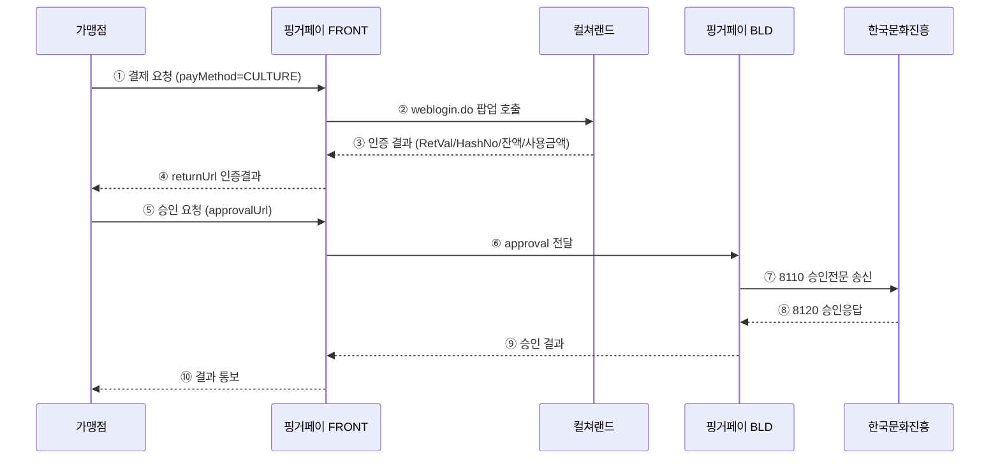

# 컬처캐쉬 (CURT) 결제수단 추가

> 핑거페이에 컬처캐쉬(한국문화진흥 컬쳐랜드, ID/PW 방식) 결제수단을 신규 추가하는 프로젝트.

## 프로젝트 메타

| 항목 | 값 |
|---|---|
| 대상 시스템 | 핑거페이 FRONT, BLD-v3 |
| 신규 PM_CD | `32` (CULTUREGIFT) |
| 신규 SPM_CD | `07` (CURT) — `SPM_CD_CURT`, `DESC1='CURT'` |
| 신규 PTN_CD | `CULT` |
| 신규 테이블 | `TBAT_CURT` (FRONT), `TBTR_CURT` / `TBUS_CURT` (BLD) |
| 취소 정책 | **전체취소 + 망상취소만** (부분취소 미지원) |
| 개발 예상 | 약 **2개월** (1인 단독 기준, 26.5 MD) |

## 산출물

- [[2026-05-18_컬처캐쉬_연동_분석보고서_v01.0]] — 분석 보고서 (CURT 테이블 명세, 컬쳐랜드 ↔ 핑거페이 매핑, 공수 산정, 테스트 환경 구성 포함)
- [[2026-05-18_핑거페이_가맹점연동가이드_컬처캐쉬_v01.0]] — 가맹점용 연동 가이드 (docx)
- [[2026-05-18_컬처캐쉬_테스트환경_setup]] — 테스트 환경 SQL setup 스크립트

## 처리 흐름 (요약)

## 일정 (마스터 보고 기준)

| 단계 | 기간 |
|---|---|
| 요구사항 확정 / DDL 검토 | 0.5개월 (2주) |
| FRONT·BLD 개발 / DB 적용 | 1.0개월 (4주) |
| 통합 테스트 (QA) | 0.5개월 (2주) |
| **합계** | **2.0개월 (8주)** |

> ⚠ **리스크**: 컬처캐쉬(한국문화진흥) 측 계약 완료 → 가맹점 키(MemberCode) 발급 후 실연동 테스트 가능. 계약 일정에 따라 추가 지연 가능성.

## 외부 참고 자료 (원본 위치)

- `C:\Users\finger\Downloads\01. 작업\07. 컬처캐시 연동\` (작업 원본 폴더)
- `핑거페이_가맹점연동가이드_인증결제_v0.9.4.docx` (기존 카드 인증결제 가이드, 본 가이드의 기준)
- `FW_ Fwd_ 컬쳐캐시 연동 가이드/컬쳐캐쉬연동 전문 (IDPW 방식)/IDPW방식_결제전문.doc`
- `웹_컬쳐랜드로그인전문.docx`, `모바일웹_컬쳐랜드로그인전문.docx`

## 코드베이스 참조 (작업 원본 기준)

- `front/src/main/java/solpay/wiezon/com/payMethod/service/CultureCashService.java` — step1 일부 구현 완료
- `front/src/main/java/solpay/wiezon/com/common/inf/Constants.java` — `PM_CD_32_CULTURELAND`, `SPM_CD_07_CURT` (신규 추가 필요)
- `front/src/main/resources/templates/culture/common.html` — 컬쳐랜드 로그인 팝업 view (step1 완료)
- `bld-v3/src/main/resources/mapper/card.xml` — 신규 `curt.xml` 작성 시 참조 패턴

## 다음 액션

- [ ] DDL 검토 회의 (DBA 협업) — CURT 3종 테이블
- [ ] 컬처캐쉬 계약 진행 상황 확인 → 가맹점 키 발급 시점 확정
- [ ] [[2026-05-18_컬처캐쉬_테스트환경_setup]] DB 팀 전달 → 개발 DB 적용
- [ ] FRONT `Constants.java` 에 `SPM_CD_07_CURT = "07"` 상수 추가 PR
- [ ] BLD `curt.xml` / `CultureCashService` 신설 PR
- [ ] 통합 테스트 시나리오 T1~T9 작성 및 실행

## 변경 이력

| 일자 | 버전 | 내용 |
|---|---|---|
| 2026-05-18 | v01.0 | 최초 분석 보고서 / 가이드 / SQL setup 작성. SPM_CD 07(CURT) 신규 정의. 부분취소 미지원 반영. |
