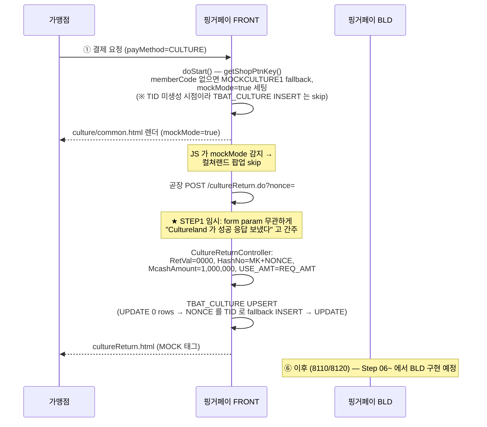
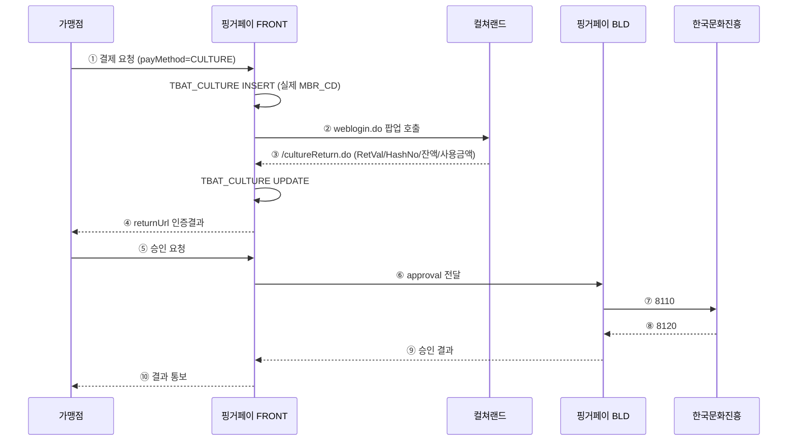

# 컬처캐쉬 연동 — 최종 적용본 (현행 상태)

> 이 문서는 **현재 시점에 실제 적용된 상태** 만을 기록합니다.
> 변경 이력 / 시행착오는 [[_INDEX]] 의 "변경 이력" 표와 날짜별 step 노트를 참조하세요.
> **수정 규칙**: 코드/DB/명명이 바뀔 때마다 이 파일의 해당 섹션을 **덮어쓰기** (이력은 별도 step 노트로).

---

## 1. 명명 규약 (최종)

| 레이어 | 항목 | 값 |
|---|---|---|
| 코드 | PM_CD 상수 | `Constants.PM_CD_32_CULTURE = "32"`, `Constants.PM_CD_CULTURE_32 = "CULTURE"` |
| 코드 | SPM_CD 상수 | `Constants.SPM_CD_07_CULTURE = "07"`, `Constants.SPM_CD_CULT_07 = "CULTURE"` |
| 코드 | PTN_CD 상수 (로컬, CultureCashService) | `PTN_CD_CULT = "CULT"` (4자 제한 — 상수명·값 일치) |
| 코드 | Mock MemberCode 상수 (CultureCashService + CultureReturnController) | `MOCK_MEMBER_CODE = "MOCKCULTURE1"` (양쪽 동기) |
| 코드 | Mock 진입 트리거 | `CultureCashService.doStart()` 에서 `memberCode` 가 빈 값 또는 `MOCKCULTURE1` 이면 `mockMode=true` 세팅 → JS 가 팝업 skip |
| DB | 테이블 | `TBAT_CULTURE` (FRONT), `TBTR_CULTURE` / `TBUS_CULTURE` (BLD) |
| DB | 컬럼 | `CULTURE_USER_ID` / `CULTURE_CUST_ID` (TBAT/TBTR), `CULTURE_RSLT_CD` / `CULTURE_RSLT_MSG` (TBUS) |
| DB | TBAD_CODE PM_CD/32 | `META_KEY='CULTURE'` |
| DB | TBAD_CODE SPM_CD/07 | `META_KEY='SPM_CD_CULTURE'`, `DESC1='CULTURE'` |
| DB | TBSI_PTN_CPID.PTN_CD | `'CULT'` (4자 제한) |
| DB | TBSI_PTN_CPID.PTN_CPID | `'MOCKCULTURE1'` (12자) |

> 💡 **혼동 주의**: `PTN_CD` 만 `'CULT'` (4자 제한). 그 외 코드/DB 레이어는 모두 `CULTURE` (또는 `MOCKCULTURE1`).

---

## 2. DB 스키마 (최종, v03 적용 기준)

**활성 SQL**: `C:\claude\vault\업무\컬처캐쉬\2026-05-19_컬처캐쉬_DB셋업_v03.sql`

### 2-1) 신규 테이블 3종

| 테이블 | 위치 | 용도 | 키 인덱스 |
|---|---|---|---|
| `TBAT_CULTURE` | FRONT | 컬쳐랜드 로그인 인증 결과 (호출 파라미터 + 콜백 응답) | PK=TID, IX_01(NONCE), IX_02(MID, REG_DNT) |
| `TBTR_CULTURE` | BLD | 컬처캐쉬 거래 원장 (8110/8120 매핑) | PK=TID, IX_01(CTRL_CD), IX_02(MBR_CTRL_CD), IX_03(TR_DT, MBR_CD) |
| `TBUS_CULTURE` | BLD | 컬처캐쉬 실패 원장 (8120/8220/8720 실패) | PK=LOG_ID (AUTO_INCREMENT), IX_01(TID), IX_02(REG_DNT), IX_03(CULTURE_RSLT_CD) |

### 2-2) 공용 테이블 등재 (총 7 rows)

| 테이블 | 키 | 값 |
|---|---|---|
| `TBAD_CODE` | (COL_NM=PM_CD, CODE1=32) | META_KEY=`CULTURE`, USE_FLG=`1` (기존 row UPDATE) |
| `TBAD_CODE` | (COL_NM=SPM_CD, CODE1=07) | META_KEY=`SPM_CD_CULTURE`, DESC1=`CULTURE`, DESC2=`N` (신규) |
| `TBAD_CODE` | (COL_NM=RSLT_CD, CODE1=32) | 5건: 0000/F201/F901/3081/F999 (핑거페이 내부 결과코드) |
| `TBAD_CODE` | (COL_NM=CULTURE_RSLT_CD) | **109건** — 컬쳐랜드 자체 응답코드 → 내부 RSLT_CD/32 매핑 (CODE1: 01=로그인 31건 / 02=결제 41건 / 03=취소 14건 / 04=부분취소 23건). NICEPG_RSLT_CD 패턴 차용. 2026-05-21 추가 |
| `TBSI_PTN_CPID` | (PTN_CD=`CULT`, PTN_CPID=`MOCKCULTURE1`) | MOCK 파트너 마스터 (PM_CD=32, SPM_CD=07, 컬쳐랜드 테스트 URL JSON) |
| `TBSI_MBS_PTN_LNK` | (MID=`100000098m`, PM_CD=32, SPM_CD=07) | PTN_CD=`CULT`, PTN_CPID=`MOCKCULTURE1` |
| `TBSI_MBS_SVC` | (MID=`100000098m`, PM_CD=32, SPM_CD=07) | USE_FLG=`1` |

---

## 3. FRONT 코드 — 컬처캐쉬 관련 파일 (절대경로)

### 3-1) 신규 작성한 파일

| 파일 | 절대경로 | 용도 |
|---|---|---|
| CultureMapper.java | `C:\Users\finger\Downloads\01. 작업\07. 컬처캐시 연동\front\src\main\java\solpay\wiezon\com\mapper\CultureMapper.java` | mybatis 매퍼 인터페이스 (4 메서드) |
| CultureMapper.xml | `C:\Users\finger\Downloads\01. 작업\07. 컬처캐시 연동\front\src\main\resources\mapper\CultureMapper.xml` | TBAT_CULTURE INSERT/UPDATE/SELECT/CHECK |
| CultureReturnController.java | `C:\Users\finger\Downloads\01. 작업\07. 컬처캐시 연동\front\src\main\java\solpay\wiezon\com\controller\CultureReturnController.java` | `/cultureReturn.do` 콜백. **STEP1 임시: 호출만 들어오면 항상 RetVal=0000 으로 합성**. UPSERT 패턴 (UPDATE 0 rows → NONCE 를 TID 로 fallback INSERT → UPDATE) 으로 doStart() TID 타이밍 이슈 우회 |
| cultureReturn.html | `C:\Users\finger\Downloads\01. 작업\07. 컬처캐시 연동\front\src\main\resources\templates\culture\cultureReturn.html` | 콜백 결과 페이지 (MOCK/LIVE 태그) |
| orderSampleCulture.html | `C:\Users\finger\Downloads\01. 작업\07. 컬처캐시 연동\front\src\main\resources\templates\sample\orderSampleCulture.html` | 결제 테스트 페이지 (다이렉트 결제) |
| cancelSampleCulture.html | `C:\Users\finger\Downloads\01. 작업\07. 컬처캐시 연동\front\src\main\resources\templates\sample\cancelSampleCulture.html` | 취소 테스트 페이지 (전체/망상 취소) |

### 3-2) 수정한 파일

| 파일 | 절대경로 | 변경 요약 |
|---|---|---|
| Constants.java | `C:\Users\finger\Downloads\01. 작업\07. 컬처캐시 연동\front\src\main\java\solpay\wiezon\com\common\inf\Constants.java` | `PM_CD_32_CULTURE`/`PM_CD_CULTURE_32="CULTURE"`/`SPM_CD_07_CULTURE="07"`/`SPM_CD_CULT_07="CULTURE"` 추가 |
| CultureCashService.java | `C:\Users\finger\Downloads\01. 작업\07. 컬처캐시 연동\front\src\main\java\solpay\wiezon\com\payMethod\service\CultureCashService.java` | `PTN_CD_CULT="CULT"` 상수, `MOCK_MEMBER_CODE="MOCKCULTURE1"` 상수, CultureMapper 주입, doStart() spmCd 교체 + TBAT_CULTURE INSERT, returnUrl `/cultureReturn.do?nonce={NONCE}`, **memberCode 빈 값 fallback + `mockMode` 플래그 추가** |
| culture/common.html | `C:\Users\finger\Downloads\01. 작업\07. 컬처캐시 연동\front\src\main\resources\templates\culture\common.html` | **`mockMode=true` 감지 시 컬쳐랜드 팝업 skip → 곧장 returnUrl 로 form POST (`submitMockReturn()`)** |
| info-local.json / info-dev.json / info-prod.json | `C:\Users\finger\Downloads\01. 작업\07. 컬처캐시 연동\front\src\main\resources\info-{env}.json` | **`"CULTURE"` 엔트리 추가** (IP=127.0.0.1, PORT=20501) — 없으면 `PayMethodService.doResult()` 에서 NPE |
| CommonService.java | `C:\Users\finger\Downloads\01. 작업\07. 컬처캐시 연동\front\src\main\java\solpay\wiezon\com\common\service\CommonService.java` | `PM_CD_32_CULTURELAND` → `PM_CD_32_CULTURE` |
| ExtraInfoService.java | `C:\Users\finger\Downloads\01. 작업\07. 컬처캐시 연동\front\src\main\java\solpay\wiezon\com\common\service\ExtraInfoService.java` | 상동 |
| CommonController.java | `C:\Users\finger\Downloads\01. 작업\07. 컬처캐시 연동\front\src\main\java\solpay\wiezon\com\controller\CommonController.java` | 상동 |
| PaymentOrderReq.java | `C:\Users\finger\Downloads\01. 작업\07. 컬처캐시 연동\front\src\main\java\solpay\wiezon\com\dto\request\v1Rest\PaymentOrderReq.java` | 상동 |
| WiezonUtil.java | `C:\Users\finger\Downloads\01. 작업\07. 컬처캐시 연동\front\src\main\java\solpay\wiezon\com\util\WiezonUtil.java` | switch case 정리, 별도 "CULTURE" 분기 제거 |
| sample.html | `C:\Users\finger\Downloads\01. 작업\07. 컬처캐시 연동\front\src\main\resources\static\sample.html` | 메뉴 「문화상품권」 행 추가 (orderSampleCulture/cancelSampleCulture 링크) |

### 3-3) 삭제된 파일 (구 명명)

| 파일 | 비고 |
|---|---|
| `CurtMapper.java` | CultureMapper 로 대체 |
| `CurtMapper.xml` | CultureMapper.xml 로 대체 |
| `orderSampleCurt.html` | orderSampleCulture.html 로 대체 |
| `cancelSampleCurt.html` | cancelSampleCulture.html 로 대체 |

---

## 4. BLD 코드 — 컬처캐쉬 관련 파일

### 4-1) 신규 작성한 파일 (Step 05~06 완료)

| 파일 | 절대경로 | 용도 |
|---|---|---|
| CultureMapper.java | `C:\Users\finger\Downloads\01. 작업\07. 컬처캐시 연동\bld-v3\src\main\java\bld\wiezon\com\biz\beans\culture\mapper\CultureMapper.java` | mybatis 매퍼 인터페이스 (6 메서드) |
| culture.xml | `C:\Users\finger\Downloads\01. 작업\07. 컬처캐시 연동\bld-v3\src\main\resources\mapper\culture.xml` | TBTR_CULTURE / TBUS_CULTURE INSERT/UPDATE/SELECT |
| CultureConstants.java | `C:\Users\finger\Downloads\01. 작업\07. 컬처캐시 연동\bld-v3\src\main\java\bld\wiezon\com\biz\beans\culture\CultureConstants.java` | PM_CD/SPM_CD/PTN_CD/Mock 상수 |
| CommonCultureMethod.java | `C:\Users\finger\Downloads\01. 작업\07. 컬처캐시 연동\bld-v3\src\main\java\bld\wiezon\com\biz\beans\culture\CommonCultureMethod.java` | Mock 8120/8220 응답 합성 헬퍼 |
| PayCultureBean.java | `C:\Users\finger\Downloads\01. 작업\07. 컬처캐시 연동\bld-v3\src\main\java\bld\wiezon\com\biz\beans\culture\PayCultureBean.java` | 승인 처리 (ProcInterface+PayInterface, STEP1 Mock) |
| CancelCultureBean.java | `C:\Users\finger\Downloads\01. 작업\07. 컬처캐시 연동\bld-v3\src\main\java\bld\wiezon\com\biz\beans\culture\CancelCultureBean.java` | 취소 처리 (전체/망상취소, STEP1 Mock) |

### 4-2) 수정한 파일

| 파일 | 절대경로 | 변경 요약 |
|---|---|---|
| mybatis-config-co.xml | `C:\Users\finger\Downloads\01. 작업\07. 컬처캐시 연동\bld-v3\src\main\resources\mybatis-config-co.xml` | `<mapper resource="mapper/culture.xml" />` 한 줄 추가 |
| payinfo-local.json / payinfo-dev.json / payinfo-prod.json | `C:\Users\finger\Downloads\01. 작업\07. 컬처캐시 연동\bld-v3\src\main\resources\co\payinfo\payinfo-{env}.json` | **`pmCd=32 / bldId=CULTURE / bldPort=20501` 엔트리 추가** — VACNT 패턴 차용, `saveTbtrCulture` mandatory insert 등록 |

### 4-3) Step 07 에서 수정 예정

| 예정 파일 | 위치 | 용도 |
|---|---|---|
| `common.xml` 수정 | `bld-v3/src/main/resources/mapper/common.xml` | saveMstr 등에 PM_CD=32 분기 추가 (TBTR_MSTR 적재) |

---

## 5. 처리 흐름 (현행)

### 5-1) STEP1 임시 흐름 (현재 작동 — 컬쳐랜드 가맹점코드 수령 전, "항상 성공" 처리)

### 5-2) LIVE 모드 흐름 (가맹점코드 수령 후 — 미구현)

**현재 구현 범위**: Mock 흐름의 ① ~ TBAT_CULTURE UPDATE 까지. BLD 송신/응답(8110~8120) 은 Step 05~ 에서 작업.

---

## 6. Phase 진행 현황

### Phase 1 — 데이터/스키마 적재 (✅ 완료, DB v02 → v03 재적용 대기)

- [x] v02 SQL 1차 적용 (CURT 명명)
- [ ] **v03 SQL 재적용 (CULTURE 통일, TEARDOWN+CREATE)** — 사용자 실행 대기

### Phase 2 — FRONT 소스 수정 (✅ Step 02~04 완료)

- [x] Step 02 — Constants.java 상수 추가 + CultureCashService spmCd 교체
- [x] Step 03 — CultureMapper.java/xml 신설
- [x] Step 04 — CultureReturnController + cultureReturn.html (MOCK 분기)

### Phase 2 — BLD 소스 수정 (⏳ 진행 중)

- [x] Step 05 — BLD `culture.xml` 신설 (CultureMapper.java + culture.xml + mybatis-config 등록) ✅ 2026-05-19
- [x] Step 06 — BLD CultureCashService Mock 모드 (CultureConstants + CommonCultureMethod + PayCultureBean + CancelCultureBean) ✅ 2026-05-19
- [ ] Step 07 — BLD `common.xml` saveMstr PM_CD=32 분기 추가

### Phase 3 — 실연동 (⏳ 가맹점코드 수령 후)

- [ ] `UPDATE TBSI_PTN_CPID/MBS_PTN_LNK SET PTN_CPID='<실제코드>'`
- [ ] Mock 분기 코드 제거 또는 환경변수 toggle
- [ ] 통합 테스트 T1~T9 실행
- [ ] 운영 배포

---

## 6-A. 해시(Hash) 정리 — 두 종류 공존

| 항목 | 핑거페이 `hashString` | 컬쳐랜드 `LoginHashCode` |
|---|---|---|
| 알고리즘 | **SHA-256** | **MD5** |
| 인증 방향 | 가맹점 → 핑거페이 | 가맹점 → 컬쳐랜드 |
| 비밀키 | `TBSI_MBS_KEY.MKEY` | 없음 (평문 조합) |
| 사용 시점 | `/payment/v1/approval` (그리고 cancel/billing 등) | 컬쳐랜드 `weblogin.do` / `mobilelogin.do` 팝업 |
| 검증 위치 | FRONT `@ValidHashMap` AOP (`AnnotationAspect`) | 컬쳐랜드 서버 |
| 공식 | `SHA256(mid + ediDate + goodsAmt + mkey)` | `md5(MemberCode + "CU" + LoginDate + "LT" + LoginTime + "UR" + Amount + "EL" + ClientIp + "AND" + ReturnUrl)` |
| 코드 위치 | `CultureReturnController.cultureReturn()` (model 에 담아 템플릿 hidden 필드로) | `CultureCashService.makeLoginHashCode()` (private static, Step 01 부터) |
| 저장 컬럼 | (저장 안 함, 1회용 검증) | `TBAT_CULTURE.LOGIN_HASH_CD` |

> 둘은 **인증 짝(가맹점↔핑거페이 vs 가맹점↔컬쳐랜드)** 가 달라서 동시에 필요. 한쪽으로 통합 불가.

> **MOCK 단계 한계**: 컬쳐랜드 팝업 skip 으로 `LoginHashCode` 가 실제 컬쳐랜드로 송신되지 않음 (TBAT_CULTURE 저장만). LIVE 전환 시 `culture/common.html` 의 `submitMockReturn()` 분기 제거 → 원래의 `openCulturelandLoginPopup()` form POST 가 활성화되면서 실제 송신됨.

---

## 7. 알려진 한계 / TODO

1. **CultureReturnController STEP1 임시 항상 성공** — 현재 `/cultureReturn.do` 는 form param 무관하게 RetVal=0000 으로 합성. 컬쳐랜드 실연동 시점에 form param (RetVal/HashNo/etc) 사용하는 REAL 분기로 전환 필요. 코드 내 `// STEP1` 주석 부위 검색.
2. **CultureCashService.doStart() TID 타이밍 이슈** — TID 가 doStart() 이후에 생성되므로 TBAT_CULTURE INSERT 가 doStart 시점에서는 skip 됨. 임시로 `culture/common.html` 의 `submitMockReturn()` 이 `paymethodRes.tid` 를 hidden form 필드(`tid`, `mid`, `reqAmt`)로 전달하고, 콜백 컨트롤러가 그 값으로 보강 INSERT 함. (안전망: form param 도 비었으면 NONCE 를 임시 TID 로 사용하지만 의미상 부적절하므로 로그 warn 출력) 근본 해결: TID 생성 타이밍을 doStart 이전으로 옮기거나 doStart 내부에서 직접 createTid 호출.
3. ~~**`selectMerchantInfo` 의 spmCd='01' 이슈**~~ — **2026-05-19 해결됨**: `AdditionalValidationManager` AOP 의 `settingDefaultData()` 끝에 `overrideSpmCdForPmCd(dto, PM_CD_32_CULTURE, SPM_CD_07_CULTURE)` 추가하여 PM_CD=32 시 spmCd='07' 강제 보정. + `CommonService` 의 culture stub 분기에서도 SPM_CD_01_AUTH → SPM_CD_07_CULTURE 로 정정.
4. **가맹점 returnUrl auto-POST 미구현** — `/cultureReturn.do` 가 현재 디버그용 결과 페이지만 렌더. Step 06~ 에서 BLD 승인 흐름 완성 후 가맹점-facing 콜백 hidden form 추가.
5. **HashNo timeout 검증 미구현** — `TBAT_CULTURE.REG_DNT` 기준 10분 timeout 정책 결정 후 별도 추가.
6. **NONCE 위조 방지 (CSRF/replay)** — 콜백 인입 시 `LOGIN_HASH_CD` 재계산해 1차 검증 필요. 보안 리뷰 시점에 보강.

---

## 8. 산출물 인덱스 (활성 + superseded)

| 파일 | 상태 | 절대경로 |
|---|---|---|
| 분석 보고서 | active | `C:\claude\vault\업무\컬처캐쉬\2026-05-18_컬처캐쉬_연동_분석보고서_v01.0.md` |
| DB 셋업 SQL v03 ★ | **active** | `C:\claude\vault\업무\컬처캐쉬\2026-05-19_컬처캐쉬_DB셋업_v03.sql` |
| **CULTURE_RSLT_CD 등재 SQL (v03 보조)** ★ | **active (2026-05-21 신규)** | `C:\claude\vault\업무\컬처캐쉬\2026-05-21_컬처캐쉬_CULTURE_RSLT_CD_등재.sql` |
| 가맹점 연동 가이드 | active | `C:\claude\vault\업무\컬처캐쉬\2026-05-18_핑거페이_가맹점연동가이드_컬처캐쉬_v01.0.docx` |
| Step 01 변경파일 노트 | done | `C:\claude\vault\업무\컬처캐쉬\2026-05-18_컬처캐쉬_FRONT변경파일목록_step01.md` |
| Step 02 변경파일 노트 | done | `C:\claude\vault\업무\컬처캐쉬\2026-05-19_컬처캐쉬_FRONT변경파일목록_step02.md` |
| Step 03 변경파일 노트 | done | `C:\claude\vault\업무\컬처캐쉬\2026-05-19_컬처캐쉬_FRONT변경파일목록_step03.md` |
| Step 04 변경파일 노트 (FRONT) | done | `C:\claude\vault\업무\컬처캐쉬\2026-05-19_컬처캐쉬_FRONT변경파일목록_step04.md` |
| Step 05 변경파일 노트 (BLD) | done | `C:\claude\vault\업무\컬처캐쉬\2026-05-19_컬처캐쉬_BLD변경파일목록_step05.md` |
| Step 06 변경파일 노트 (BLD) | done | `C:\claude\vault\업무\컬처캐쉬\2026-05-19_컬처캐쉬_BLD변경파일목록_step06.md` |
| 네이밍 규약 정정 노트 | active (참고용) | `C:\claude\vault\업무\컬처캐쉬\2026-05-19_컬처캐쉬_네이밍규약_정정.md` |
| **현행상태 (본 문서)** | **active** | `C:\claude\vault\업무\컬처캐쉬\_LATEST.md` |
| DB 셋업 SQL v02 | superseded | `C:\claude\vault\업무\컬처캐쉬\2026-05-18_컬처캐쉬_DB셋업_v02.sql` |
| DB 셋업 SQL v01 | superseded | `C:\claude\vault\업무\컬처캐쉬\2026-05-18_컬처캐쉬_테스트환경_setup.sql` |

---

## 9. 다음 액션 (사용자) — 2026-05-20 시작 지점

| 우선순위 | 항목 | 비고 |
|---|---|---|
| 🔴 **1 (내일 첫 작업)** | **BLD JVM 인스턴스 실행** — `-Dspring.profiles.active=local -Dbld.id=CULTURE -Dbld.type=co -Ddb.url=... -Ddb.name=...` | 부팅 로그 `port : 20501` 확인 + `netstat -an \| findstr 20501` LISTEN 검증. IntelliJ Run Configuration 은 기존 BLD 구성 복제 후 VM 옵션 `bld.id` 만 `CULTURE` 로 변경 |
| 🟡 2 | FRONT 결제 E2E — `sample.html` → 「문화상품권 결제」 → 콜백 결과 페이지의 「🚀 BLD 승인 처리 진행」 클릭 → `/payment/v1/approval` → BLD TCP 송신 (이번엔 ConnectException 없이) → PayCultureBean Mock 응답 | BLD 로그 `[culture-pay] STEP1 Mock — 8110 송신 skip, 8120 성공 응답 합성` 확인, `SELECT * FROM TBTR_CULTURE ORDER BY REG_DNT DESC LIMIT 1;` row 확인 |
| 🟢 3 | **Step 07 진입** — BLD `common.xml saveMstr` 의 PM_CD=32 분기 추가 (TBTR_MSTR 적재 컬처캐쉬 컬럼 매핑) | E2E 검증 통과 후. `_INDEX.md` Phase 2 마지막 체크박스 |
| ⚪ 4 | 통합 테스트 시나리오 T1~T9 (분석보고서 §8 참고) | Step 07 완료 후 Phase 3 진입 전 |

---

*최종 갱신: 2026-05-21. 코드/DB/명명이 바뀌면 본 파일의 해당 섹션을 덮어쓰기.*

---

## 10. 공통코드 — CULTURE_RSLT_CD 매핑 정책 (2026-05-21 추가)

NICEPG (`NICEPG_RSLT_CD`) 와 동일 패턴으로 컬쳐랜드 자체 응답코드를 `TBAD_CODE` 에 등재.

| 컬럼 | 의미 |
|---|---|
| `COL_NM` | `'CULTURE_RSLT_CD'` |
| `CODE1` | 거래 구분: `01`=로그인 인증 / `02`=결제 승인 / `03`=취소 / `04`=부분취소 |
| `CODE2` | `'*'` |
| `CODE3` | 컬쳐랜드 RetVal 코드 (4자리, `0000`/`0450`/... `0801`/`0802`) |
| `CODE4` | 내부 매핑 결과코드 (RSLT_CD/32 의 5건 중 하나) |
| `DESC1` | 한글 메시지 |
| `DESC2` | `'컬쳐랜드응답코드'` |
| `DESC3` | `'32'` (PM_CD) |

**CODE4 매핑 규칙**:
- `0000` (정상) → CODE3=`0000`
- `F201` (사용자 인증 취소) → 푸시 로그인 승인 대기류 (`0480`/`0481` of CODE1=02)
- `F901` (컬쳐랜드 통신 실패) → DB/시스템/통신 (`0417`/`0418`/`0462`/`0463`/`0473`/`0801`/`0802`)
- `3081` (잔액 부족) → 금액/한도 (`0402`/`0408`/`0413`/`0414`/`0478`)
- `F999` (기타 실패) → 그 외 전부

**출처**: `[최신]쇼핑몰에러코드정의.pptx` (CI 방식, 6 slides)
**SQL 파일**: `C:\claude\vault\업무\컬처캐쉬\2026-05-21_컬처캐쉬_CULTURE_RSLT_CD_등재.sql`
**총 row 수**: 109 (01: 31 / 02: 41 / 03: 14 / 04: 23)

